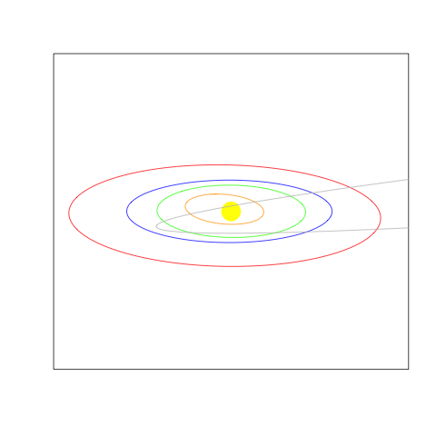

node-astronomy
==============

Calculate 3D orbits of planets and comets given orbital elements

This Javascript code is fronting as a Node module, but is really meant to be loaded into a browser environment using [Browserify](http://browserify.org/)

### Installation

	git clone https://github.com/TimeMagazine/node-astronomy.git
	cd node-astronomy
	npm install

### The data

The orbital info for the [planets](http://ssd.jpl.nasa.gov/txt/p_elem_t1.txt) and the [comets](http://ssd.jpl.nasa.gov/dat/ELEMENTS.COMET) come from JPL. We've already converted these fixed-width tables into JSON files found at `data/planets.json` and `data/comets.json`. If you want to rebuild these files to make sure they're current, run the followed commands:

	./update_comets_and_planets.js planets
	./update_comets_and_planets.js planets --pluto #if you want poor Pluto
	./update_comets_and_planets.js comets

This will overwrite the files from the repo with the most recent data from JPL, though for planets it does not appear to change often.

### Usage

	var astronomy = require("./index");

	var earth = astronomy.planets.planet("Earth");
	var halley = astronomy.comets.comet("Halley (1986)");

If you give `earth` the old `console.log`, you'll see it has an element called `positions`:

	{
	  "key": "Earth",
	  "info": {
	    "color": "#66CCFF",
	    "diameter": 12756,
	    "rotation_period": 1,
	    "orbital_period": 365.26
	  },
	  "positions": [
	    {
	      "date": "2014-12-31T05:00:00.000Z",
	      "position": {
	        "ecliptic": [
	          -0.14530893602582962,
	          0.9725529260974349,
	          0.00003321337538343582
	        ]
	      }
	    },
	    {
	      "date": "2015-01-03T05:00:00.000Z",
	      "position": {
	        "ecliptic": [
	          -0.19696827172231163,
	          0.9633741996434886,
	          0.000032917795100756254
	        ]
	      }
	    },
	    /* and so forth */
	  ]
	}

The positions represent the planet's place in the solar system at each date. The solar system is three dimensional, so it makes sense that we would have three positional points for each date.

But you only have two dimensions to work with, most likely, so you'll want to project the solar system onto a surface. For that, you can use the `project` method:

	var Earth_xy = astronomy.project(earth, 30, 200);

The second argument is the angle from which to view the solar system (in degrees) and the second is how many pixels one astronomical unit should equal.

Here's an [R plot](test/plot.R) of the output of the `project` method for the inner solar system and Haley's comet:

